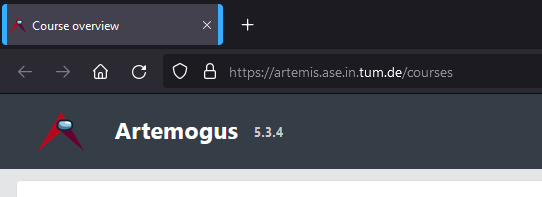

# TUM-userscripts
This repository contains user scripts for online services of the [Technical University of Munich](https://www.tum.de/). Some of these scripts are useful and some others are just for fun.

Obviously this is not official in any way, and anything that happens (e.g. if an online exam page were to work incorrect because of these scripts) is your own fault.

### Useful
* [Moodle Login Redirect](moodle-login-redirect.user.js?raw=true): When you are redirected to the page that asks you to select TUM/LMU login, it automatically clicks the "TUM login" button. This just saves you a click.
* [Moodle Fix Semester Selection](moodle-fix-semester-selection.user.js): Fixes the semester selection dropdown, such that the latest semester is used instead of WiSe 2024/25

Other Moodle scripts that likely no longer work due to the redesign:
* [Moodle Show Calendar Course Info](moodle-calendar-course-names.user.js?raw=true): Show course names next to calendar events on the home/start page
* [Moodle Announce Less](moodle-announce-less.user.js?raw=true): Allows up to three news items in the "News" section of a course and removes all other news
* [Moodle Panopto Show More](moodle-panopto-showmore.user.js?raw=true): Automatically clicks the "Show more" button on Panopto content of a moodle course

### Fun
* [Artemogus](artemis-artemogus.user.js?raw=true): Replaces the Artemis logo with the image of a special Amogus

### Installation
You can use these scripts in any browser that has a user-script manager addon.
I recommend [ViolentMonkey](https://violentmonkey.github.io/). You can get it for [Firefox](https://addons.mozilla.org/firefox/addon/violentmonkey/), [Chromium/Chrome](https://chrome.google.com/webstore/detail/violent-monkey/jinjaccalgkegednnccohejagnlnfdag), [Edge](https://microsoftedge.microsoft.com/addons/detail/eeagobfjdenkkddmbclomhiblgggliao) or [any other browser](https://github.com/violentmonkey/violentmonkey/releases).

There are two ways of installing a script:

The easy way
1. Click the link to the script (should open the "raw" file)
2. The user script manager will prompt you if you want to install the script
3. Click "Confirm installation"

The manual way
1. Click the ViolentMonkey addon icon and go to the Dashboard (settings icon).
2. Now click the "New" icon at the top left and select "Install from URL"
3. Select the script you want to use on this page, e.g. click on "Artemogus". It should open a link with the script. Copy this link.
4. Paste the link URL in the URL field of the script manager and click "OK"

**Disclaimer**: You should disable scripts for any important stuff (e.g. online exams) in case there are any conflicts.

### Trust & Security
When you use any of these scripts, you trust me that I didn't put anything malicious in them. This is something you can verify from the source code.

However, since it is possible to update these scripts, I could sneak in anything I want. **I will not do malicious updates**, but you can't truly trust me (and *any* publisher of auto-updating software) on that.

If you want to be 100% sure and without needing to trust me, you can copy these scripts to your local installation (instead of installing from an URL) and verify that the source code is what you want it to be. This will prevent automatic updates from the script URL and thus there is no chance for malicious updates.

I still recommend installing from the URL, but I just wanted to make you aware of the possible consequences (e.g. in case my GitHub account is hacked).

### Suggestions & Contributing
If you have any suggestions for improving a script or want to add something, feel free to open an issue or pull request :)

### [License](LICENSE)
This is free as in freedom software. Do whatever you like with it.
